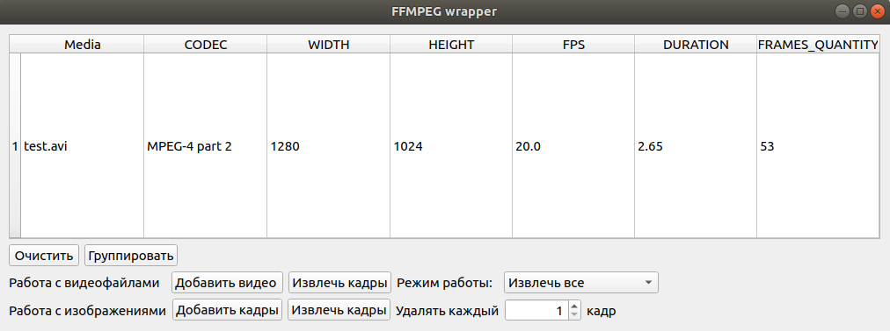
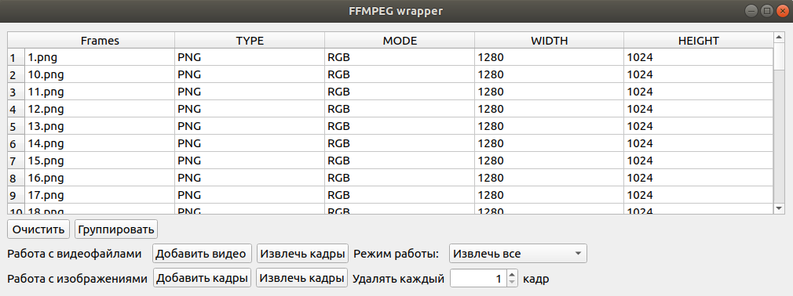

# Аннотация
GUI приложение для быстрого извлечения кадров с определенным интервалом.

## Поддерживаемые платформы
* Linux 

## Требования:
* python3, библиотеки:
  * sys
  * subprocess
  * Pillow
  * pathlib
  * PyQt5
  * natsort
  * collections
  * argparse
  * itertools
  * uuid
  * functools
  * pkgutil
  * inspect

### Запуск
```
python3 wrapper.py --help
```

# Описание
Запуск GUI осуществляется командой
```
python3 wrapper_gui.py
```
Пользователь может извлечь кадры из видео в определенную папку с различными интервалами.
<p align="center">
</p>

Пользователь может удалять кадры с различными интервалами.
<p align="center">
</p>


